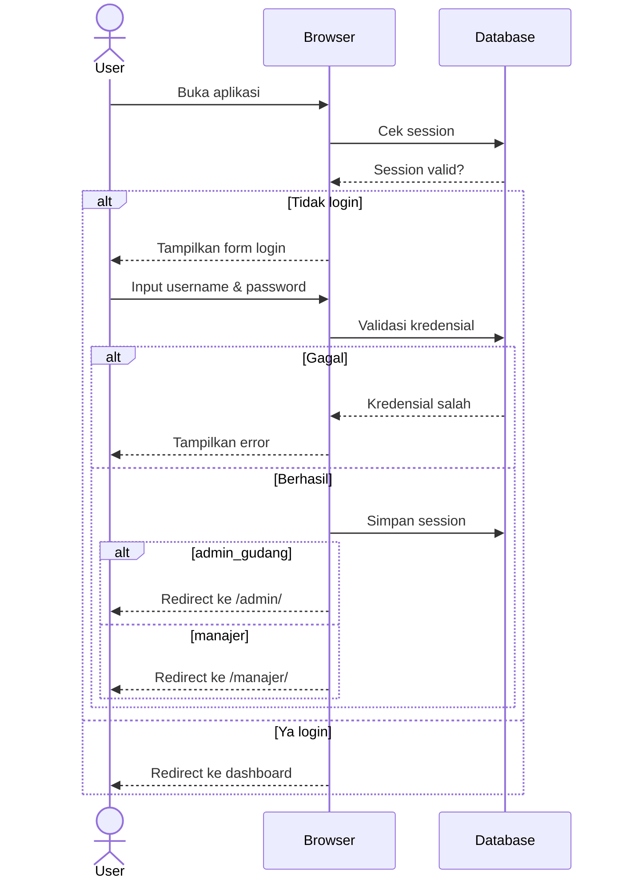
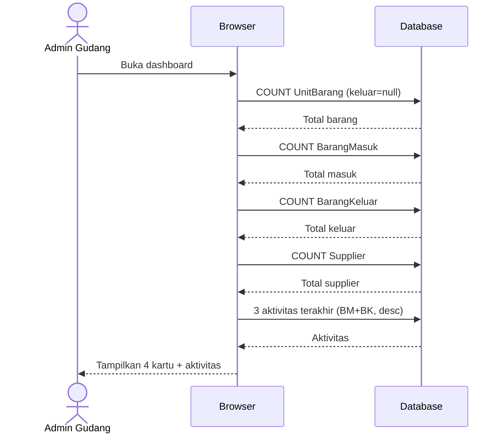
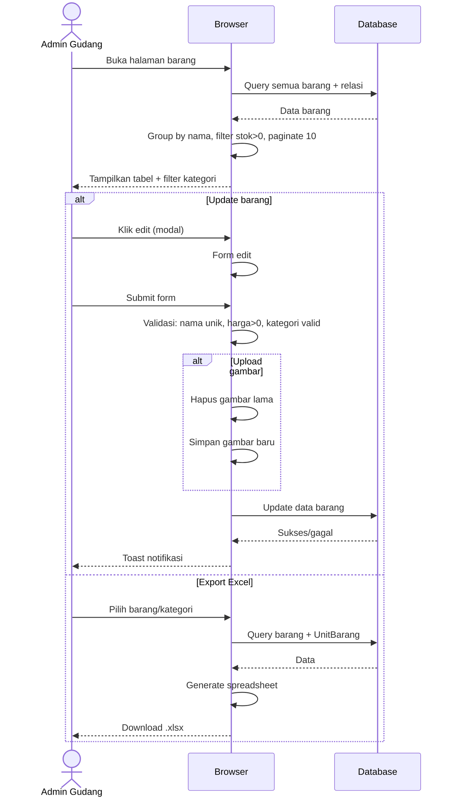
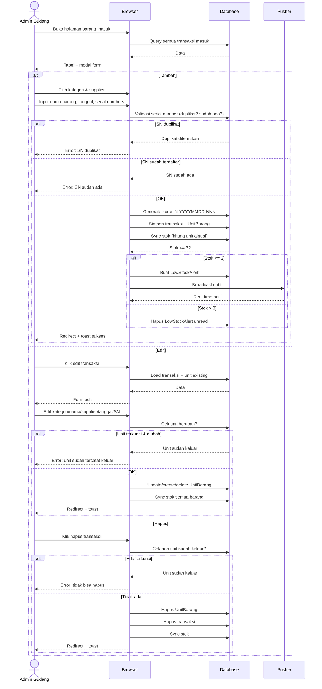
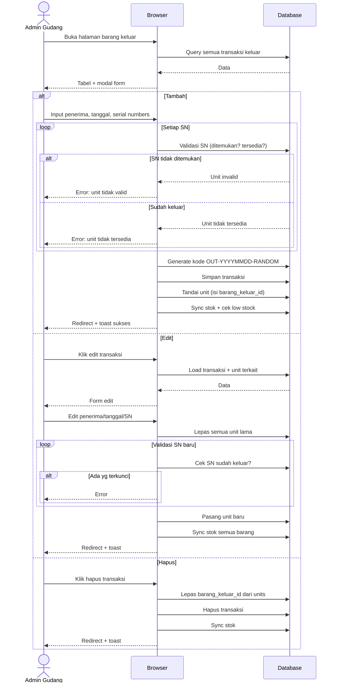
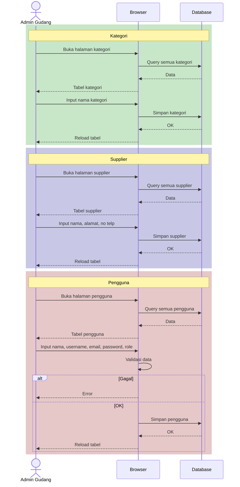
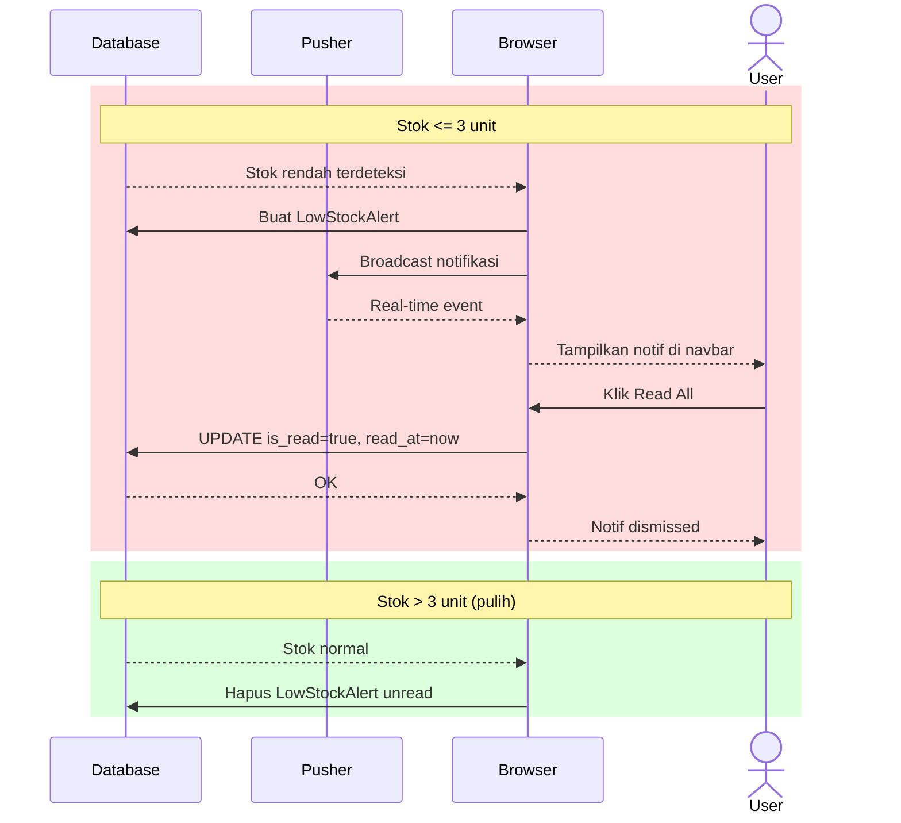
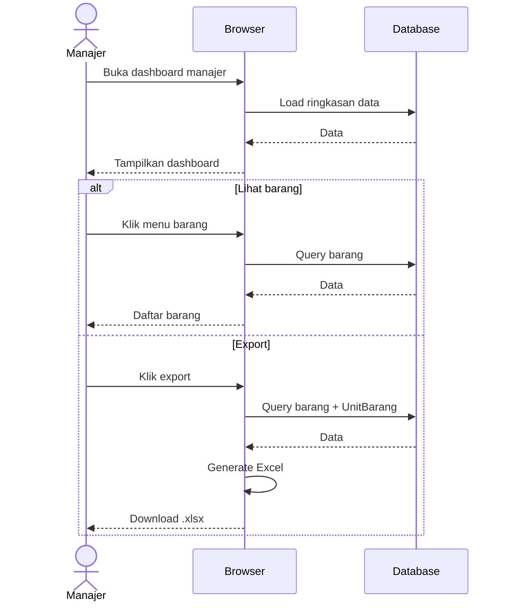
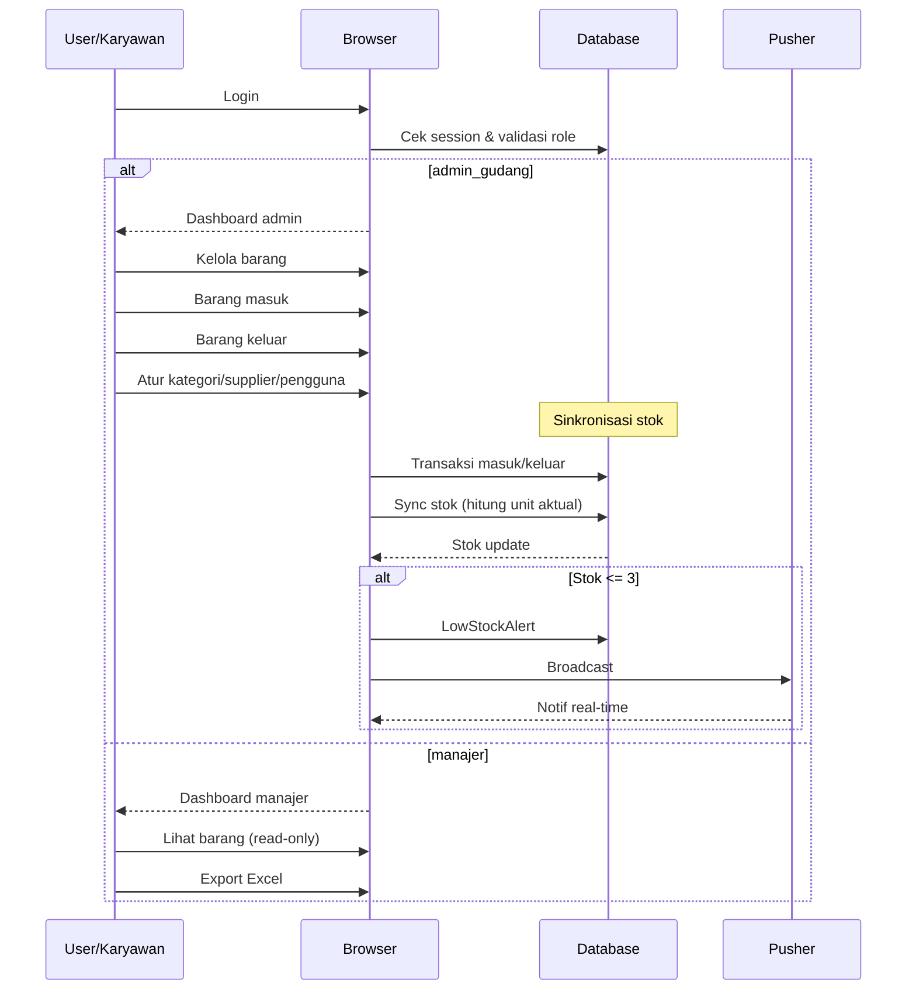

# Sequence Diagram - Pro Web (Inventory Management)

## Alur Login & Autentikasi

## Dashboard Admin Gudang

## Master Barang (Admin)

## Barang Masuk (Stock In)

## Barang Keluar (Stock Out)

## CRUD Master Data

## Notifikasi Real-time Low Stock

## Dashboard Manajer

## Hubungan Antar Modul

## Penjelasan Singkat

| Fitur | Aktor | Keterangan |
|-------|-------|------------|
| **Autentikasi** | Semua | Login session-based, throttle 5 percobaan/menit, redirect berdasarkan role |
| **Dashboard Admin** | Admin Gudang | 4 kartu statistik: total barang, barang masuk, barang keluar, supplier + 3 aktivitas terakhir |
| **Master Barang** | Admin Gudang | Lihat, edit barang (nama, harga, kategori, gambar), filter kategori, export Excel per barang/kategori |
| **Barang Masuk** | Admin Gudang | Catat penerimaan barang + serial number per unit. Auto-create barang jika nama+kategori baru. Generate kode IN-YYYYMMDD-NNN |
| **Barang Keluar** | Admin Gudang | Catat pengeluaran dengan scan serial number. Validasi ketersediaan unit. Generate kode OUT-YYYYMMDD-RANDOM |
| **Kategori** | Admin Gudang | CRUD kategori barang |
| **Supplier** | Admin Gudang | CRUD supplier (nama, alamat, no telp) |
| **Pengguna** | Admin Gudang | CRUD karyawan (nama, username, email, password, role) |
| **Dashboard Manajer** | Manajer | Lihat ringkasan read-only |
| **Barang Manajer** | Manajer | Lihat daftar barang + export Excel |
| **Low Stock Alert** | Semua (real-time) | Notifikasi stok ≤ 3 unit via Pusher. Broadcast + simpan ke DB. Dismiss via Read All |
| **Pengaturan** | Semua | Update profil (nama/username/email) dan password |

> **Catatan Arsitektur:**
> - Stok barang = hitungan aktual unit (`COUNT UnitBarang WHERE barang_keluar_id IS NULL`), bukan counter manual
> - Serial number bersifat unique secara global
> - Transaksi masuk/keluar yang sudah memiliki unit terkunci (sudah tercatat keluar) tidak bisa diedit/hapus
> - Export Excel menggunakan PhpSpreadsheet dengan grouping per nama barang + tabel ringkasan
